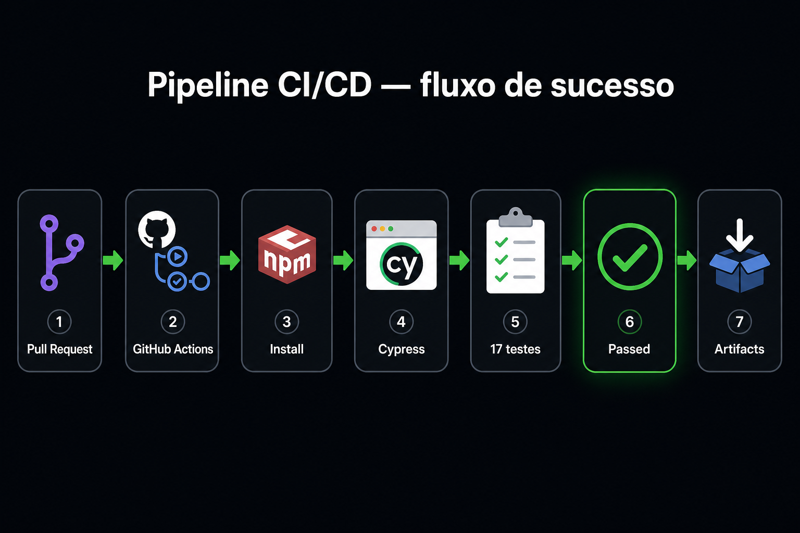
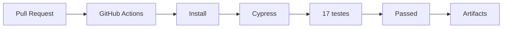
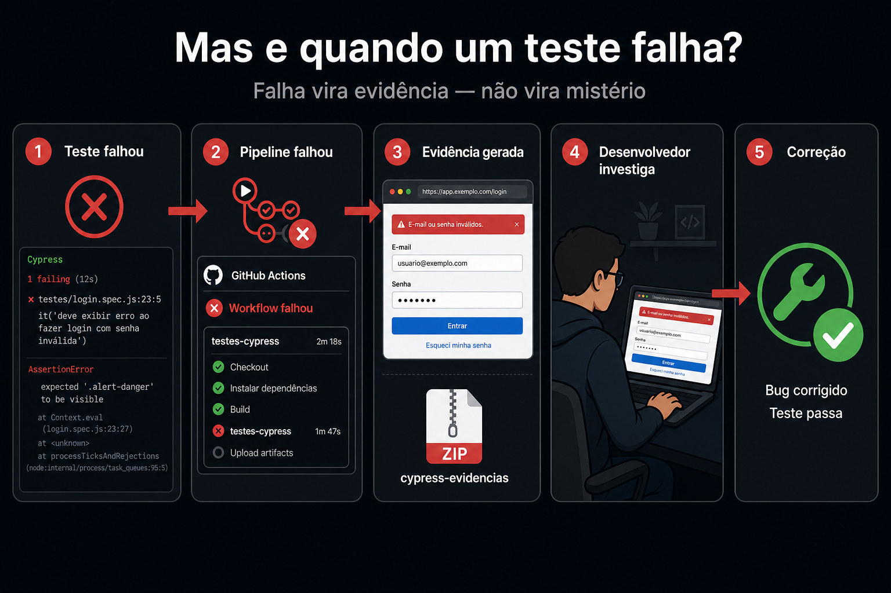
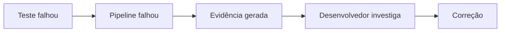
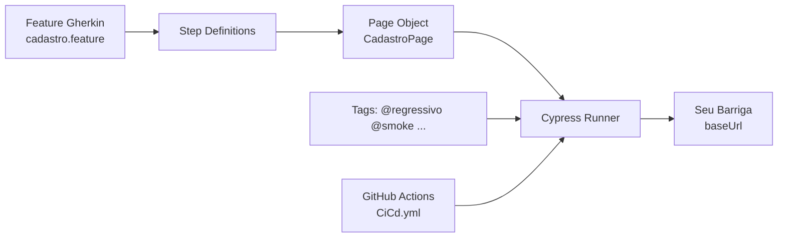

# Seu Barriga — Automação de Testes (Cypress + Gherkin)

**Repositório:** [https://github.com/AfranioAlcantara/seubarrigaCiCd](https://github.com/AfranioAlcantara/seubarrigaCiCd)

[](https://github.com/AfranioAlcantara/seubarrigaCiCd/actions/workflows/CiCd.yml)
[](https://github.com/AfranioAlcantara/seubarrigaCiCd/actions)
[](https://www.cypress.io/)
[](https://cucumber.io/docs/gherkin/)

Automação E2E da tela de **cadastro** da aplicação [Seu Barriga](https://seubarriga.wcaquino.me/cadastro), escrita em **Gherkin (BDD)**, executada com **Cypress** e integrada a uma pipeline de **CI/CD no GitHub Actions**.

O badge **CI/CD** no topo reflete o status real da última execução. Verde significa que a suíte regressiva passou na pipeline.

---

## Sumário

- [Por que esta abordagem](#por-que-esta-abordagem)
- [Pipeline visual](#pipeline-visual)
- [Mas e quando um teste falha](#mas-e-quando-um-teste-falha)
- [Sobre o projeto](#sobre-o-projeto)
- [Tecnologias](#tecnologias)
- [Arquitetura](#arquitetura)
- [Estrutura de pastas](#estrutura-de-pastas)
- [Como executar localmente](#como-executar-localmente)
- [Tags e filtros](#tags-e-filtros)
- [Exemplos dos cenários](#exemplos-dos-cenários)
- [Workflow do GitHub Actions](#workflow-do-github-actions)
- [Evidências dos testes](#evidências-dos-testes)

---

## Por que esta abordagem

A integração dos testes automatizados à pipeline permite identificar regressões automaticamente durante alterações no código, reduzindo a dependência de validações manuais repetitivas e fornecendo feedback rápido sobre a estabilidade da aplicação.

Na prática, isso significa:

- o desenvolvedor recebe o resultado **antes** de o código chegar em produção;
- a regressão da tela de cadastro não depende de alguém lembrar de testar o formulário à mão;
- uma falha não vira um “não passou”: vira **evidência** (screenshot/vídeo) para investigação;
- a suíte pode ser recortada por tag (`@smoke`, `@regressivo`, `@CT07`) conforme o risco da mudança.

O Cypress e o Gherkin são o meio. O objetivo de negócio é **proteger o cadastro de usuário** — o ponto de entrada da aplicação — a cada push.

---

## Pipeline visual

Não é necessário ler o código inteiro para entender o projeto. A pipeline faz isto:

**Pull Request → GitHub Actions → Install → Cypress → 17 testes → Passed → Artifacts**





| Etapa | O que acontece |
| --- | --- |
| Pull Request / push | O código entra na `main` ou em um PR |
| GitHub Actions | O workflow `CiCd.yml` dispara sozinho |
| Install | Dependências e o binário do Cypress são instalados (com cache) |
| Cypress | A suíte `@regressivo` roda no Chrome |
| 17 testes | Cenários Gherkin da tela de cadastro |
| Passed | O badge do README fica verde |
| Artifacts | Se falhar, screenshots e vídeos ficam disponíveis para download |

Histórico real das execuções:  
[https://github.com/AfranioAlcantara/seubarrigaCiCd/actions](https://github.com/AfranioAlcantara/seubarrigaCiCd/actions)

---

## Mas e quando um teste falha?

Uma pipeline que só mostra sucesso ensina pouco. O valor da CI/CD aparece na **falha**.





1. **Teste falhou** — um cenário Gherkin quebrou (asserção, seletor, regressão na tela).
2. **Pipeline falhou** — o job do GitHub Actions fica vermelho; o PR não passa despercebido.
3. **Evidência gerada** — o workflow publica o artifact `cypress-evidencias` com screenshot e, quando houver, vídeo.
4. **Desenvolvedor investiga** — abre a run em Actions, baixa o artifact e vê exatamente o estado da tela no momento da falha.

Isso existe para responder a uma pergunta de negócio: *o cadastro ainda funciona depois desta alteração?* Se a resposta for não, a evidência já está anexada à pipeline.

Como ver na prática: abra uma run em [Actions](https://github.com/AfranioAlcantara/seubarrigaCiCd/actions) → **Artifacts** → `cypress-evidencias`.

---

## Sobre o projeto

O objetivo é validar o cadastro de usuário de forma **regressiva**, com cenários positivos, negativos, de UI, navegação e integração (login após cadastro).

Os casos foram descritos em linguagem de negócio (Gherkin) e implementados em steps reutilizáveis, com Page Object e dados parametrizados em `Esquema do Cenário`.

Aplicação sob teste: `https://seubarriga.wcaquino.me`  
A URL completa fica apenas no `baseUrl` do Cypress. Os testes usam rotas relativas (`/cadastro`, `/login`).

---

## Tecnologias

| Camada | Tecnologia |
| --- | --- |
| Linguagem | JavaScript (Node.js) |
| Automação E2E | Cypress 15 |
| BDD / Gherkin | `@badeball/cypress-cucumber-preprocessor` |
| Bundler | esbuild + `@bahmutov/cypress-esbuild-preprocessor` |
| CI/CD | GitHub Actions |
| Navegador na pipeline | Chrome |
| Controle de versão | Git / GitHub |

---

## Arquitetura



1. O arquivo `.feature` descreve o comportamento esperado.
2. As **step definitions** traduzem cada passo Gherkin em comandos Cypress.
3. O **Page Object** concentra seletores e ações da tela de cadastro.
4. O Cypress executa contra o `baseUrl` configurado.
5. A pipeline dispara a mesma suíte no GitHub Actions, filtrando por tags.

---

## Estrutura de pastas

```text
seubarrigaCiCd/
├── .github/workflows/CiCd.yml          # Pipeline GitHub Actions
├── docs/                               # Visuais da pipeline para o README
├── cypress/
│   ├── e2e/cadastro.feature            # Cenários Gherkin
│   └── support/
│       ├── pages/CadastroPage.js       # Page Object
│       └── step_definitions/           # Implementação dos passos
├── cypress.config.js                   # baseUrl, preprocessor e tags
├── package.json
└── README.md
```

---

## Como executar localmente

### Pré-requisitos

- Node.js 18+ (recomendado 20 ou 22)
- npm
- Git

### Instalação

```bash
git clone https://github.com/AfranioAlcantara/seubarrigaCiCd.git
cd seubarrigaCiCd
npm install
npx cypress install
```

No Windows, se o PowerShell bloquear scripts, use `npm.cmd` / `npx.cmd`.

### Interface gráfica

```bash
npm run cypress:open
```

### Headless — suíte completa

```bash
npm run cypress:run
```

### Headless — regressivo ou smoke

```bash
npm run test:regressivo
npm run test:smoke
```

### Uma tag específica

```bash
npx cypress run --e2e --env tags=@CT07
```

---

## Tags e filtros

| Tag | Uso |
| --- | --- |
| `@regressivo` | Suíte de regressão (padrão na CI) |
| `@smoke` | Caminho crítico e rápido |
| `@positivo` / `@negativo` | Tipo de validação |
| `@obrigatoriedade` | Campos obrigatórios |
| `@duplicidade` | E-mail já cadastrado |
| `@formato` | E-mail inválido |
| `@navegacao` | Links do menu |
| `@ui` | Layout, placeholders e rótulos |
| `@integracao` | Cadastro + login |
| `@CT01` … `@CT17` | Caso de teste individual |

```bash
npx cypress run --e2e --env tags="@regressivo and not @integracao"
```

---

## Exemplos dos cenários

Feature: cadastro de novo usuário (`cypress/e2e/cadastro.feature`).

**Cadastro válido (parametrizado):**

```gherkin
Esquema do Cenário: Cadastrar usuário com dados válidos
  Quando o usuário preenche o cadastro com nome "<nome>", email "novo" e senha "<senha>"
  E aciona o botão "Cadastrar"
  Então o sistema deve exibir a mensagem "Usuário inserido com sucesso"

  Exemplos:
    | nome              | senha    |
    | Maria Silva       | Senha123 |
    | José da Conceição | Senha123 |
```

**Campo obrigatório em branco:**

```gherkin
Esquema do Cenário: Tentar cadastrar com um campo obrigatório em branco
  Quando o usuário preenche o cadastro com nome "<nome>", email "<email>" e senha "<senha>"
  E aciona o botão "Cadastrar"
  Então o sistema deve exibir a mensagem "<mensagem>"
  E o cadastro não deve ser concluído
```

**E-mail já utilizado:**

```gherkin
Cenário: Tentar cadastrar com e-mail já utilizado
  Dado que já existe um usuário cadastrado com o e-mail "usuario.existente@teste.com"
  Quando o usuário preenche o cadastro com nome "Outro Nome", email "usuario.existente@teste.com" e senha "Senha123"
  E aciona o botão "Cadastrar"
  Então o sistema deve exibir a mensagem "Endereço de email já utilizado"
```

A feature completa está em [`cypress/e2e/cadastro.feature`](https://github.com/AfranioAlcantara/seubarrigaCiCd/blob/main/cypress/e2e/cadastro.feature).

---

## Workflow do GitHub Actions

Arquivo: [`.github/workflows/CiCd.yml`](https://github.com/AfranioAlcantara/seubarrigaCiCd/blob/main/.github/workflows/CiCd.yml)

```yaml
on:
  push:
    branches: [main]
  pull_request:
    branches: [main]
  workflow_dispatch:
    inputs:
      tags:
        description: Tag Cucumber para executar
        type: choice
        default: '@regressivo'
```

| Evento | O que roda |
| --- | --- |
| `push` / `pull_request` na `main` | `@regressivo` |
| `workflow_dispatch` | tag escolhida no Run workflow (`@smoke`, `@CT07`, etc.) |

O job usa `cypress-io/github-action`, runner `ubuntu-24.04` e timeout de 20 minutos. Em falha, o artifact `cypress-evidencias` é publicado automaticamente.

---

## Evidências dos testes

- **Local:** screenshots em `cypress/screenshots` quando um cenário falha.
- **CI:** o step `Publicar evidencias em caso de falha` envia `cypress/screenshots` e `cypress/videos` como artifact.
- **Como baixar:** abra a run em [Actions](https://github.com/AfranioAlcantara/seubarrigaCiCd/actions) → **Artifacts** → `cypress-evidencias`.

O status da pipeline aparece no badge no topo deste README.

---

## Autor

**Afrânio Alcântara**  
GitHub: [https://github.com/AfranioAlcantara/seubarrigaCiCd](https://github.com/AfranioAlcantara/seubarrigaCiCd)
